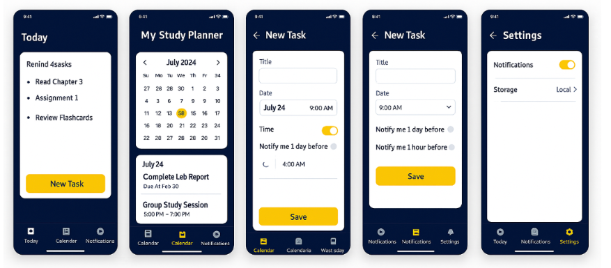

# Study Planner App

A clean, modern Flutter app to help students organize their study life and stay on top of tasks, assignments, and reminders.

---

## 📚 Purpose
This app is designed for students to:
- Organize daily study tasks and assignments
- Set reminders for important deadlines
- Visualize workload on a calendar
- Persist all data locally for offline use

## 🏗️ Project Structure & Architecture

```
lib/
  models/           # Data models (e.g., Task)
  storage/          # Local storage logic (e.g., TaskStorage)
  screens/          # UI screens (Today, Calendar, Settings, Login, Profile)
  widgets/          # Reusable UI widgets (e.g., UserProfileAvatar)
  main.dart         # App entry point, MaterialApp, routes
  entry_point.dart  # Handles login/profile flow and main navigation
```

- **Separation of Concerns:**
  - UI, business logic, and data models are organized in separate folders for clarity and maintainability.
- **Modular Code:**
  - Each screen and widget is implemented as a separate class/file.
- **Comprehensive Comments:**
  - Key classes and functions are commented to explain intent and design choices.

## ✨ Features

- **Task Management:**
  - Create, edit, and delete tasks with title, description, due date, and optional reminder.
  - View tasks for today or any selected date.
- **Calendar View:**
  - Monthly calendar with highlighted dates for scheduled tasks.
  - Tap any date to see tasks for that day.
- **Reminders:**
  - Set reminder times for tasks.
  - Pop-up alarm with animation appears when a reminder is due (even if the app is open).
- **Local Storage:**
  - All tasks are saved locally using `shared_preferences` for persistent access.
- **Profile & Settings:**
  - Local login with name/avatar, editable profile, and settings page.
- **Navigation:**
  - Bottom navigation bar for Today, Calendar, and Settings screens.
- **Material Design:**
  - Clean, responsive UI with consistent Material widgets and layout.

## 🚀 Getting Started

1. **Install Flutter:** [Flutter Install Guide](https://flutter.dev/docs/get-started/install)
2. **Enable Developer Mode on Windows:** Required for plugin support.
3. **Install dependencies:**
   ```
   flutter pub get
   ```
4. **Run the app:**
   ```
   flutter run
   ```
   - Use an Android emulator or physical device.

## 🗂️ Key Components

- **Task Model:** (`lib/models/task.dart`)
  - Defines the structure of a task, including serialization for storage.
- **Task Storage:** (`lib/storage/task_storage.dart`)
  - Handles saving/loading tasks using `shared_preferences`.
- **Screens:** (`lib/screens/`)
  - `today_screen.dart`: Shows today’s tasks, handles reminders and alarm popups.
  - `calendar_screen.dart`: Calendar view with task highlights.
  - `settings_screen.dart`: App settings and storage info.
  - `login_page.dart`, `profile_settings_page.dart`: User profile and login flow.
- **Widgets:** (`lib/widgets/`)
  - `user_profile_avatar.dart`: Displays user avatar/name in the app bar.
- **Navigation:**
  - `main.dart` sets up named routes and MaterialApp.
  - `entry_point.dart` manages login/profile and main navigation.

## 📝 Code Quality

- **Consistent formatting** and naming conventions throughout.
- **Comprehensive comments** on key classes, functions, and logic.
- **Modular structure** for easy maintenance and extension.

## 📸 Screenshots



---

Built with ❤️ using Flutter.